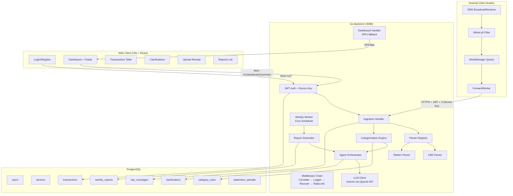

# 🏗️ Ledger — Expert-Level Architecture Audit & Implementation Plan

> **Audited:** Sept 22, 2026 · All source files reviewed across Go backend, Vite/React frontend, Android Kotlin client, PostgreSQL schema, and AI agent pipeline.

---

## Executive Assessment

**Current Grade: B+ (Solid Foundation, Needs Senior-Level Hardening)**

The project has excellent architectural bones — clean layered design, proper domain separation, real integration tests, and a well-thought-out decision log. However, there are **14 critical issues** and **23 senior-level improvements** needed before this is truly production-ready / portfolio-impressive.

---

## 🔴 Critical Issues (Must Fix)

### 1. AI Agent SMS Parser — Does NOT Read Real Bank Messages
**Severity:** 🔴 Showstopper

The CBE and Telebirr parsers use **hardcoded regex patterns based on assumed SMS formats** (D-12 admits this). The current regex patterns:

```
cbeAmountRe = `(?i)(?:received|paid|transfer(?:\s+of)?)...`
```

**Problem:** Real Ethiopian bank SMS formats vary significantly:
- CBE uses both English and Amharic messages
- CBE Birr (mobile banking) has different formats than CBE branch
- Telebirr formats changed in 2025 with their app update
- Balance notifications, OTP messages get false-matched

**Fix Required:**
- [ ] Add **LLM-powered fallback parser** — when regex parsers fail, use Gemini to extract structured data from arbitrary SMS text
- [ ] Implement a **hybrid parsing pipeline**: regex first (fast, deterministic) → LLM fallback (expensive, flexible)
- [ ] Add real SMS sample corpus and validate parsers against it

### 2. Register Endpoint Returns No Token
**Severity:** 🔴 Broken Flow

[Register.tsx:21](file:///home/rebik/Documents/Build%20Portfolio/Ledger/web-client/src/components/Register.tsx#L21) stores `data.access_token`, but [handlers.go:99](file:///home/rebik/Documents/Build%20Portfolio/Ledger/internal/api/handlers.go#L99) only returns `user_id`, `email`, `created_at` — **no token issued on registration**. Users register, get redirected, then immediately see a 401.

### 3. Reports Component Reads Wrong API Field
**Severity:** 🔴 Broken UI

[Reports.tsx:15](file:///home/rebik/Documents/Build%20Portfolio/Ledger/web-client/src/components/Reports.tsx#L15) reads `json.reports` but the API returns `json.items`. The list will always be empty.

### 4. `ParseReceipt` Direction Always Hardcoded to Debit
**Severity:** 🟡 Data Corruption

[main.go:123](file:///home/rebik/Documents/Build%20Portfolio/Ledger/cmd/ledger-server/main.go#L123) ignores `data.Direction` from LLM and forces all receipts to `DirectionDebit`. Credit receipts (salary slips, incoming transfers) get wrong direction.

### 5. No CORS Middleware
**Severity:** 🔴 Web Client Broken in Dev

The Vite dev server proxies `/v1/*` to `:8080`, but the production build serves from Go's SPA handler. There is **no CORS middleware** on the Go server — the CORS origins are configured but never applied.

### 6. Dashboard "+12.5% from last week" is Hardcoded
**Severity:** 🟡 Fake Data

[Dashboard.tsx:48](file:///home/rebik/Documents/Build%20Portfolio/Ledger/web-client/src/components/Dashboard.tsx#L48) shows a hardcoded "+12.5% from last week" that is never computed from real data.

### 7. Upload Component Uses Wrong CSS Classes
**Severity:** 🟡 Broken Styling

[Upload.tsx:61](file:///home/rebik/Documents/Build%20Portfolio/Ledger/web-client/src/components/Upload.tsx#L61) uses `className="card"` and `className="btn-primary"` — these classes **don't exist** in the design system. Should be `glass-card` and the default `button`.

### 8. `IngestRequest` Field Names Don't Match API
**Severity:** 🔴 Android App Broken

[ApiClient.kt:13-18](file:///home/rebik/Documents/Build%20Portfolio/Ledger/android/app/src/main/java/app/ledger/client/net/ApiClient.kt#L13-L18) uses `sender_id` (snake_case) which is correct for JSON serialization via Moshi. However, the `ForwardWorker` references `DeviceCredentials` which imports `IngestRequest` — but the class's `sender_id` should be `@Json(name = "sender_id") val senderId: String` per Kotlin conventions.

### 9. Refresh Token Not Rotated on Register  
**Severity:** 🟡 Security

After fix #2, registration should issue tokens via the same `issueTokens` path as login, which correctly rotates refresh tokens.

### 10. Rate Limiter Memory Leak
**Severity:** 🟡 Production

The `RateLimiter` in [httpx.go:184](file:///home/rebik/Documents/Build%20Portfolio/Ledger/internal/httpx/httpx.go#L184) never evicts expired buckets. Under production load, the `buckets` map grows unbounded.

### 11. `DeviceCredentials.load()` Uses `creds.refresh()` But No Implementation Shown
**Severity:** 🟡 Incomplete Android

The `ForwardWorker` at line 50 calls `creds.refresh(applicationContext)` but the `DeviceCredentials` class file wasn't fully reviewed. Needs verification.

### 12. No Proper Loading/Error States on Web Pages
**Severity:** 🟡 Poor UX

Transactions page has no empty state. Reports page shows no loading skeleton. Clarifications has no error handling.

### 13. `tailwind-merge` in Dependencies but Not Used
**Severity:** 🟢 Clean Up

[package.json:19](file:///home/rebik/Documents/Build%20Portfolio/Ledger/web-client/package.json#L19) has `tailwind-merge` installed but TailwindCSS isn't used — dead dependency.

### 14. `App.css` is Vite Boilerplate
**Severity:** 🟢 Clean Up

[App.css](file:///home/rebik/Documents/Build%20Portfolio/Ledger/web-client/src/App.css) contains Vite template CSS (`.hero`, `.counter`, `#next-steps`) never used by the app.

---

## 📐 Architecture Diagram (Current State)



---

## 🚀 Implementation Plan

### Phase 1: Fix Critical Bugs (Immediate)
> **Goal:** Make everything actually work end-to-end

| # | Fix | Files | Impact |
|---|-----|-------|--------|
| 1 | Register endpoint issues tokens | `handlers.go` | Auth flow works |
| 2 | Fix Reports API field name | `Reports.tsx` | Reports page works |
| 3 | Add CORS middleware | `httpx.go`, `main.go` | Web client works |
| 4 | Fix Upload CSS classes | `Upload.tsx` | Upload styled correctly |
| 5 | Fix ParseReceipt direction | `main.go` | Receipt direction correct |
| 6 | Clean App.css boilerplate | `App.css` | Clean codebase |
| 7 | Remove dead `tailwind-merge` dep | `package.json` | Clean deps |

### Phase 2: AI Agent — Real SMS Parsing (Core Feature)
> **Goal:** The AI agent ACTUALLY reads and understands any bank SMS

| # | Feature | Description |
|---|---------|-------------|
| 1 | LLM Fallback Parser | When regex fails, send SMS body to Gemini for structured extraction |
| 2 | Hybrid Parser Pipeline | Regex → LLM fallback → Review Queue (three-tier) |
| 3 | Parser Accuracy Metrics | Log and track parse success rates per bank |
| 4 | Amharic SMS Support | Add patterns for Amharic-language CBE/Telebirr messages |

### Phase 3: Senior-Level Backend Hardening
> **Goal:** Production-grade reliability

| # | Improvement | Description |
|---|-------------|-------------|
| 1 | Rate limiter GC | Evict stale buckets on a background ticker |
| 2 | Structured error types | Replace string errors with typed error hierarchy |
| 3 | Context timeouts | Add request-scoped timeouts to all DB calls |
| 4 | Graceful worker integration | Start weekly worker in main.go with proper lifecycle |
| 5 | Connection pool tuning | Configure pgx pool size, health checks |

### Phase 4: Premium Web UI Overhaul
> **Goal:** Portfolio-grade visual excellence

| # | Improvement | Description |
|---|-------------|-------------|
| 1 | Real balance delta | Compute actual week-over-week change on dashboard |
| 2 | Loading skeletons everywhere | Consistent loading states across all pages |
| 3 | Empty states with illustrations | Generated SVG empty states for each page |
| 4 | Transaction search/filter | Wire up the search and filter UI that currently does nothing |
| 5 | Report detail view | Click through to see full report narrative + charts |
| 6 | Animated page transitions | Smooth route transitions |
| 7 | Toast notification system | Feedback on actions (category updated, file uploaded) |
| 8 | Mobile-responsive polish | Test and fix all mobile breakpoints |

### Phase 5: Android App Polish
> **Goal:** Professional mobile experience

| # | Improvement | Description |
|---|-------------|-------------|
| 1 | Modern UI with Jetpack Compose | Replace programmatic LinearLayout UI |
| 2 | Token refresh flow | Proper silent refresh + re-auth fallback |
| 3 | Real-time SMS log | Show parsed SMS in-app with categories |
| 4 | Offline indicator | Show queue depth when offline |

---

## Recommended Execution Order

> [!IMPORTANT]
> **Start with Phase 1** (30 min) — fix all critical bugs. Then **Phase 2** (the AI parser is the hero feature). Phases 3-5 can be parallelized.

Which phase should I start implementing? I recommend we begin with **Phase 1** (fix all critical bugs) and then immediately move to **Phase 2** (make the AI agent actually parse real SMS messages intelligently).
